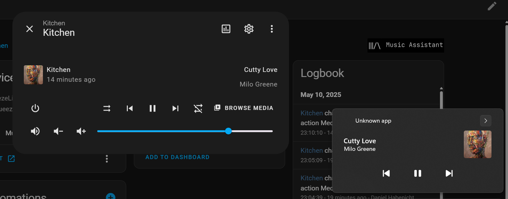

# Media Controls


???+ info

    This will be part of the Insiders program and will only be available for sponsors.

The media controls platform can be used in two different ways:

1. **Mirror Mode**: Control an entity from Home Assistant via your native device media controls and show the current playing media on this device.
2. **Media Player**: Control the media player on your device via Home Assistant and show the current playing media in home assistant.

## Mirror Mode



```yaml
media_controls:
  # The display_entity activates the mirror mode.
  display_entity: media_player.kitchen
```


## Media Player

```yaml
media_controls:

media_player:
 - platform: media_controls
   name: Example Media Player 
```


> Huge thanks to the author of this package: https://github.com/Sinono3/souvlaki